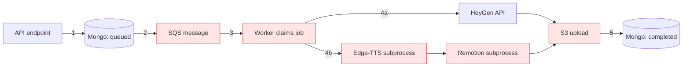

# Fault Tolerance: Making Video Generation Resilient

This document analyzes the failure modes of the video generation pipeline and
specifies how to make it fault tolerant. It is grounded in the current codebase:
FastAPI + AWS SQS + two async workers (`AvatarJobWorker`, `RemotionJobWorker`) +
HeyGen / Edge-TTS / Remotion + MongoDB + S3.

For the broader system architecture, see [project-deepdive.md](project-deepdive.md).

---

## 1. The Pipeline and Its Failure Points

The generation flow is a chain of hand-offs, and **every arrow is a place the
job can be lost or corrupted**:

```
API → MongoDB (queued) → SQS → worker → [ HeyGen | Edge-TTS + Remotion subprocess ] → S3 → MongoDB (completed)
```



---

## 2. Failure Modes (Current Behavior)

| # | Failure | Current behavior | Impact |
|---|---------|------------------|--------|
| 1 | Worker crashes mid-render | SQS message reappears after the 120s visibility timeout | Full re-render; possible duplicate processing |
| 2 | Remotion `npx remotion render` hangs | Has a hardcoded 600s timeout in `render_video()`, but timeout output is not preserved in the raised error and the limit is not configurable | Worker slot eventually frees, but failures are hard to triage and can redeliver if SQS visibility is too short |
| 3 | Edge-TTS subprocess hangs or fails | Captures stderr on non-zero exit, but has no timeout and uses shell invocation | Worker slot can still hang indefinitely; errors can miss stdout/context |
| 4 | S3 upload fails after a successful render | No retry, no rollback | Render work lost, status left inconsistent |
| 5 | HeyGen transient errors (429/timeout) | Retried up to 3× via SQS, no backoff | Wasted credits, no throttling |
| 6 | Two workers grab the same message | Status checked but not atomically | Duplicate render race (see also report gaps #5/#8) |
| 7 | Render produces 0-byte / corrupt MP4 | Not validated before completion | "completed" video that won't play |
| 8 | Inline Remotion path | RESOLVED — all templates now enqueue to SQS; the in-process task is only a fast-start fallback | A crash leaves a recoverable SQS message instead of a lost job |
| 9 | Synchronous hybrid endpoint | RESOLVED — endpoint is now async (queued + poll); render runs on the worker via SQS | Durable; **breaking API change** — see §3.7 |
| 10 | Record stranded in `processing` after a crash | Remotion and avatar workers reap stale `processing` jobs | Job eventually fails instead of hanging forever |

---

## 3. Principles and How They Map to This Code

### 3.1 Make every job idempotent and re-runnable
The single most important property. SQS **will** redeliver (crash, visibility
timeout, `maxReceiveCount` retries), so every job must be safe to run twice.

The ingredient already exists: the deterministic payload hash at
[main.py:1993](../app/main.py#L1993). Today it only short-circuits *direct*
requests. Extend it:

- **Atomic claim in the worker** — replace the read-then-check with an atomic
  `find_one_and_update({_id, status: 'queued'} → 'processing')`. If it doesn't
  match, another worker owns the job; drop the message. Closes failure mode #6.
- **Key S3 objects by payload hash**, not a random id, so a re-render overwrites
  the same key instead of orphaning files.

### 3.2 Bound every external call with a timeout
A fault-tolerant system never waits forever.

- **Remotion subprocess** (`render_video()` in
  [remotion_service.py](../app/services/remotion_service.py)): keep the current
  `subprocess.run(..., timeout=600)` behavior, but make it explicit and
  observable:
  - Move the timeout to config, for example
    `REMOTION_RENDER_TIMEOUT_SECONDS=900`.
  - Capture both `stdout` and `stderr` separately, or combine them deliberately
    when the CLI interleaves progress logs.
  - On `TimeoutExpired`, include the captured output tail in `error_message`
    before marking the job `failed`.
  - Set the **SQS visibility timeout longer than this render timeout** plus a
    buffer for upload/status update, or SQS can redeliver while the first worker
    is still rendering.
- **Edge-TTS subprocess** (`generate_tts()` in
  [remotion_service.py](../app/services/remotion_service.py)): add the same
  timeout contract. Today this path can wait forever. It should run with
  `timeout=N`, `stdin=subprocess.DEVNULL`, and captured `stdout`/`stderr`, then
  raise an exception that preserves the useful command output.
- HeyGen already enforces polling timeouts — good.

Recommended subprocess error contract:

```python
def _tail(text: str | bytes | None, limit: int = 4000) -> str:
    if isinstance(text, bytes):
        text = text.decode("utf-8", errors="replace")
    return (text or "").strip()[-limit:]

try:
    result = subprocess.run(
        command,
        cwd=str(self.remotion_path),
        check=False,
        text=True,
        capture_output=True,
        stdin=subprocess.DEVNULL,
        timeout=settings.remotion_render_timeout_seconds,
    )
except subprocess.TimeoutExpired as exc:
    raise RuntimeError(
        "Remotion render timed out after "
        f"{settings.remotion_render_timeout_seconds}s. "
        f"stdout={_tail(exc.stdout)!r} stderr={_tail(exc.stderr)!r}"
    ) from exc

if result.returncode != 0:
    raise RuntimeError(
        f"Remotion render failed with exit code {result.returncode}. "
        f"stdout={_tail(result.stdout)!r} stderr={_tail(result.stderr)!r}"
    )
```

Use the same pattern for Edge-TTS, with its own timeout such as
`EDGE_TTS_TIMEOUT_SECONDS=120`. Prefer argv-list subprocess calls over
`shell=True` so customer text, file paths, and voice names cannot affect shell
parsing. If a platform-specific command string is unavoidable, keep the current
temporary text file approach and still capture output with a timeout.

Minimum expected `error_message` fields for subprocess failures:

| Field | Why |
|-------|-----|
| `stage` (`tts` / `remotion_render`) | Makes worker failures searchable |
| `timeout_seconds` | Confirms whether this was a bounded failure |
| `exit_code` when present | Distinguishes process crash from timeout |
| `stdout_tail` and `stderr_tail` | Preserves CLI diagnostics without storing huge logs |
| `command_name` only, not full secrets-bearing command | Avoids leaking credentials or user text into MongoDB/logs |

### 3.3 Retry transient failures with backoff; fail fast on permanent ones
Not all errors are equal:

- **Transient** (network blip, S3 503, HeyGen 429/timeout) → retry with
  **exponential backoff + jitter**. Wrap S3 uploads (#4) and HeyGen calls.
- **Permanent** (insufficient credits, invalid `avatar_id`, bad template props)
  → do not burn 3 SQS retries. Mark `failed` immediately. The classifier in
  [heygen_client.py:49-101](../app/services/heygen_client.py#L49-L101) already
  distinguishes several of these — branch on it to decide retry vs. fail.

### 3.4 Use a Dead Letter Queue
After `maxReceiveCount=3` a message is currently dropped. Configure an **SQS DLQ**
on the `Video-generation` queue so poison messages land somewhere inspectable.
Add a periodic sweep that surfaces DLQ items for triage.

### 3.5 Validate output before declaring success
A render that produced a 0-byte or corrupt MP4 must not become `completed`. The
hybrid service already uses **ffprobe** — apply the same check (file size and
duration > 0) on the Remotion path before the S3 upload and status flip. Fixes #7.

### 3.6 Reconcile stuck jobs (the reaper)
Crashes strand records in `processing`. Both workers now run a **reaper**:
Remotion uses render timeout + SQS visibility timeout, and avatar uses HeyGen
poll timeout + SQS visibility timeout. Stale jobs are marked `failed` so users
stop waiting forever. Fixes #10.

### 3.7 Eliminate the no-queue paths (DONE)
Both no-queue paths now route through SQS, so the worker + reaper machinery
protects them. Fixes #8 and #9.

**Inline Remotion path** (`/generate/remotion`): previously, asset-dependent local
templates were rendered by an in-process `asyncio` task with **no** SQS message —
a process restart lost the job. Now every template is enqueued to SQS; the
in-process task remains only as a fast-start fallback, and the worker's atomic
claim (§3.1) guarantees exactly one of the two renders. Safe because the
deployment is single-box: any SQS consumer has the freshly-bundled local assets.

**Hybrid endpoint** (`/generate/hybrid-remotion-avatar-pip`): converted from
synchronous to **async**. The request now validates input (still 400s on bad
`avatar_id` / `voice_id` / `collection_status`), persists a `queued` record,
enqueues to SQS, and returns immediately. The avatar generation + PiP render run
on the Remotion worker via a dedicated `_process_hybrid_job` (routed there because
the hybrid `request_mode` contains "remotion"), reusing the atomic claim,
transient-retry / fail-fast handler, and ffprobe validation. The final MP4 is now
also uploaded to **S3** for durability (the `/tmp/hybrid-public` copy is ephemeral).

> ⚠️ **Breaking API change.** The hybrid endpoint's response changed from the full
> `HybridRemotionAvatarPipResponse` (`final_video_url`, `width`, `height`,
> `duration_seconds`) returned synchronously, to an async ack
> `HybridRemotionAvatarPipJobAck` = `{success, video_id, status:"queued"}`. Clients
> must poll `GET /videos/{video_id}/status?request_mode=hybrid_remotion_avatar_pip`,
> which surfaces `status`, `video_url`, and the `width`/`height`/`duration_seconds`
> fields once complete. The bundled frontend (`Index.tsx` / `lib/api.ts`) was
> updated to poll on a 5s interval, mirroring the Remotion flow.

### 3.8 SQS visibility timeout (⚠️ requires an AWS-side change)
The visibility timeout **must exceed the longest a worker holds a message before
deleting it**. A Remotion job runs TTS (`edge_tts_timeout_seconds`, 600s) **then**
render (`remotion_render_timeout_seconds`, 600s) sequentially, then an S3 upload —
worst case ≈ 1200s + buffer. If the visibility timeout is shorter, SQS makes the
message visible again mid-job; the redelivery is dropped by the atomic claim
(§3.1), which is safe but **loses SQS redelivery as the crash-recovery path** (the
reaper §3.6 then becomes the only backstop).

`sqs_visibility_timeout_seconds` is set to **1500** in
[app/config.py](../app/config.py). This value reaches each worker differently:

- **Avatar worker** passes `VisibilityTimeout` explicitly on every receive
  ([job_worker.py:110](../app/workers/job_worker.py#L110)) — the
  config value applies immediately.
- **Remotion worker** receives via `sqs_service.receive_messages`, which does
  **not** pass `VisibilityTimeout` — it inherits the **queue's AWS-side default**.

**Deploy requirement:** set the default visibility timeout on the
`Video-generation` queue to **≥ 1500s**, or the Remotion path keeps the old queue
default regardless of config:

```bash
aws sqs set-queue-attributes \
  --queue-url https://sqs.ap-south-1.amazonaws.com/873184615731/Video-generation \
  --attributes VisibilityTimeout=1500
```

Or: SQS console → `Video-generation` → Edit → Visibility timeout → 1500s. Keep the
queue value ≥ the config value so both paths agree. Note the reaper cutoff is
`remotion_render_timeout + sqs_visibility_timeout` = 600 + 1500 = 2100s, safely
above the ~1200s legitimate max — so a still-running job is never prematurely
reaped.

---

## 4. Implementation Priority

Highest leverage first:

| Order | Change | Status | Removes |
|-------|--------|--------|---------|
| 1 | Atomic status claim in both workers | Done | Duplicate renders (#6) |
| 2 | Remotion + Edge-TTS subprocess timeouts with stderr capture | Done | Stuck workers (#2, #3) |
| 3 | Reaper task for stale `processing` records | Done | Crash strand (#1, #10) |
| 4 | S3 + HeyGen retry-with-backoff, transient vs permanent | Done | Lost uploads, wasted credits (#4, #5) |
| 5 | SQS DLQ + ffprobe output validation | Partial — ffprobe done; DLQ pending | Poison messages, corrupt output (#7) |
| 6 | Route inline/hybrid paths through SQS | Done | No-queue loss (#8, #9) |

**Items 1–3 alone** move the system from "loses work on any crash" to
"self-healing for the common cases."

---

## 5. Key Files

| File | Relevance |
|------|-----------|
| [app/workers/job_worker.py](../app/workers/job_worker.py) | SQS polling, HeyGen generation, retry — apply atomic claim, backoff |
| [app/workers/remotion_job_worker.py](../app/workers/remotion_job_worker.py) | SQS polling, Remotion render — apply atomic claim, validation |
| [app/services/remotion_service.py](../app/services/remotion_service.py) | `render_video()` / TTS subprocesses — add timeouts, stderr capture |
| [app/services/heygen_client.py](../app/services/heygen_client.py) | API wrapper + error classification — drives retry vs fail |
| [app/services/s3_service.py](../app/services/s3_service.py) | Uploads — wrap in retry-with-backoff |
| [app/services/sqs_service.py](../app/services/sqs_service.py) | Queue I/O — configure DLQ, visibility timeout |
| [app/main.py](../app/main.py) | Endpoints, payload-hash cache, inline/hybrid paths to migrate |
