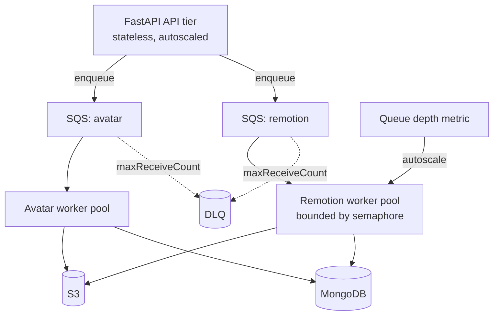
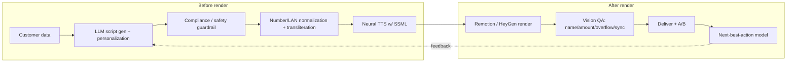

# System Design Improvements: Speed, Concurrency, UX & AI/ML

Companion to [fault-tolerance.md](fault-tolerance.md). That doc covers *not losing
work*; this one covers *being fast, scaling reliably, feeling smooth, and using
AI/ML where it actually pays off*.

Grounded in the current system: single FastAPI process with two in-process async
workers (`AvatarJobWorker`, `RemotionJobWorker`) polling one SQS queue; Remotion
rendered through a **long-lived internal renderer service** (see
[Remotion renderer service](#remotion-renderer-service) below), not per-job
`npx remotion render`; Edge-TTS; MongoDB + S3; React/Vite frontend polling status
every 5s.

---

## 0. The Three Bottlenecks to Fix First

| Bottleneck | Where | Cost today | After fix |
|---|---|---|---|
| **Webpack re-bundle on every render** | `npx remotion render` in [remotion_service.py](../app/services/remotion_service.py) | 10–30s wasted **per video** | Bundle once at boot → ~0s |
| **Workers live inside the API process** | `asyncio.create_task` at [main.py:105-122](../app/main.py#L105-L122) | API and renders fight for the same CPU; can't scale independently | Separate worker tier, scale horizontally |
| **No render concurrency control** | no semaphore around the subprocess | 2+ renders thrash the box, or 1 render idles 7 cores | Bounded, tuned parallelism |

Everything else below builds on these three.

---

## 1. Faster Video Generation

### 1.1 Stop re-bundling — use the programmatic Remotion API
`npx remotion render` re-runs webpack bundling **and** cold-starts Chromium on
every single call. Replace the subprocess with `@remotion/renderer`:

```
bundle()            // ONCE at worker startup → cached serveUrl
  ↓
selectComposition() // per job, cheap
renderMedia({ serveUrl, composition, onProgress })  // per job
```

- **`bundle()` once, reuse the `serveUrl`** for all renders. Re-bundle only when
  the Remotion source changes (watch mtime / build hash). This alone removes the
  single biggest latency contributor.
- **`onProgress` callback** gives real `renderedFrames / totalFrames` — feeds the
  progress bar in §3.
- Keeps rendering in-process (a Node sidecar service), so no per-render `npx`
  startup tax either.

### 1.2 Warm browser pool
Reuse Chromium across renders with `openBrowser()` and pass the instance into
`renderMedia`. Cold Chromium startup is ~1–3s each; a warm pool amortizes it to zero.

### 1.3 Tune the render itself
None of these flags are set today. Add and benchmark:
- **`concurrency`** = render threads. CPU-bound; set per-render threads so that
  `(render_threads × concurrent_renders) ≈ vCPUs` (see §2.2).
- **`--scale`** if the delivery resolution allows downscaling.
- **`jpegQuality` / codec** — `h264` with a sane CRF; drop quality knobs where the
  channel (WhatsApp) recompresses anyway.
- **`--gl=angle`** (or swiftshader on headless boxes) for stable GPU/software GL.

### 1.4 Cache TTS independently of the video
Edge-TTS runs once per request with **no cache** ([remotion_service.py:332-458](../app/services/remotion_service.py#L332-L458)).
Audio + VTT depend only on `(voice, normalized_text)`. Key them by
`sha256(voice + text)` in S3/Mongo and reuse across *different* videos that share a
line. Saves 5–15s whenever scripts overlap (common in templated campaigns).

### 1.5 Make the cache do more
The payload-hash cache ([main.py:1973-2016](../app/main.py#L1973-L2016)) is good but
narrow. Three upgrades:
- **Single-flight / in-flight coalescing.** Today the cache only matches
  `status='completed'`. Two identical requests arriving close together both render.
  Add a `status IN ('queued','processing')` check that *attaches* the second caller
  to the first job instead of starting a duplicate.
- **Extend to avatar + hybrid** flows (currently remotion-only).
- **Component-level cache** — cache the TTS (§1.4) and per-asset presigns even when
  the full payload differs.

### 1.6 Elastic burst rendering (optional, bigger lift)
For spiky campaign loads, add **Remotion Lambda** (`@remotion/lambda`, not currently
a dependency) as an overflow target: local pool handles steady state, Lambda absorbs
bursts with massive frame-level parallelism. Route by queue depth.

---

## 2. Concurrency That Scales Reliably



### 2.1 Separate the worker tier from the API
Move workers out of the FastAPI process into their own deployable (ECS service /
container / k8s deployment). Why it matters:
- API latency stops degrading when renders peg the CPU.
- API and workers **scale independently** — many lightweight API replicas, fewer
  heavy render workers.
- A render OOM/crash can't take down the API.

### 2.2 Bound render concurrency explicitly
Rendering is CPU- and memory-bound. Wrap the render in an `asyncio.Semaphore(N)`
where `N` is sized to the box: `N × render_threads ≲ vCPUs`, and validate against
memory (Chromium is hungry). This converts today's "uncontrolled contention or
accidental serialization" into predictable throughput. Make `N` an env var.

### 2.3 Horizontal scale is now safe — because of the atomic claim
Multiple worker instances can all poll the same SQS queue; SQS distributes messages.
This is only correct once the **atomic `find_one_and_update` claim** from
[fault-tolerance.md §3.1](fault-tolerance.md) is in place — otherwise two instances
double-render. The two docs compose: fault tolerance is the *precondition* for
horizontal concurrency.

### 2.4 Split and prioritize queues
One shared queue means a flood of avatar jobs can starve Remotion jobs (and vice
versa). Split into per-type queues (diagram above), and add a **priority lane**
(interactive/real-time requests jump ahead of bulk campaign renders). Optionally use
an SQS **FIFO** queue with the payload hash as `MessageDeduplicationId` for built-in
dedup.

### 2.5 Autoscale on queue depth
Drive worker count from `ApproximateNumberOfMessagesVisible` (CloudWatch → ASG/ECS
target tracking). Scale out when the backlog grows, scale to a floor (not zero — keep
the bundle/browser pool warm) when idle.

### 2.6 Backpressure & admission control
Expose queue depth to the API. When backlog exceeds a threshold, return a realistic
queue position/ETA (see §3.3) rather than silently accepting unbounded work.

---

## 3. Smoother User Experience

### 3.1 Real progress, not a generic spinner
Today the user sees a 3-dot spinner labeled "Rendering Text Video" with **no
percentage and no ETA** (`ProcessingScreen.tsx`). With `onProgress` from §1.1,
persist a `progress` field (`tts → bundling → rendering X% → uploading`) to the video
record and render an actual progress bar with stage labels.

### 3.2 Push updates instead of 5s polling
The frontend polls every 5s ([Index.tsx:234-245](../Frontend/src/pages/Index.tsx#L234-L245)),
so users see status up to 5s stale and the server eats constant poll traffic. Replace
with **SSE** (simplest for one-way status) or WebSocket: the worker emits
`processing → 42% → completed` events the instant they happen. If keeping polling
short-term, at least back off the interval and stop polling on terminal states.

### 3.3 Show ETA and queue position
- **ETA:** fit a simple model on historical render time vs. `(template, frame_count,
  script_length)` — even a per-template median beats "varies with length." Show a
  live countdown.
- **Queue position:** "You're #3 in line" from queue depth (§2.6) sets expectations
  during bursts.

### 3.4 Don't make the user wait on the page
They already have **WhatsApp templates** and S3 share pages. Lean in: on completion,
**notify via WhatsApp/email** with the share link so the user can close the tab. A
shareable `status` URL makes the job resumable across devices.

### 3.5 Early preview
Render and upload a **poster frame / thumbnail** early (first frame is cheap) so the
user sees their personalized content forming before the full MP4 lands. Great
perceived-speed win.

### 3.6 Surface cache hits as instant wins
When the payload-hash cache hits, the response is instant — say so ("Ready instantly")
rather than briefly flashing a spinner.

### 3.7 Graceful failure UX
On `failed`, show the normalized reason + a one-click **Retry** (idempotent thanks to
the payload hash), instead of a dead end.

---

## 4. Fitting AI/ML Into Video Generation Properly

The goal is ML where it changes outcomes — not ML as decoration. Organize it as a
**Content Intelligence service** that sits *before* rendering and a **QA/optimization
loop** that sits *after*.



### 4.1 LLM-driven script generation & localization — *highest value*
Scripts are currently static/templated ([update_script.py](../update_script.py),
default TTS scripts). Replace with an LLM that personalizes per customer (name,
amount, due date, tone) and **natively produces all 10 supported Indian languages**
instead of maintained translation tables. Use **Claude** (latest models — Opus 4.8
`claude-opus-4-8` for top script quality, Sonnet 4.6 `claude-sonnet-4-6` for the
high-volume default, Haiku 4.5 `claude-haiku-4-5-20251001` for cheap classification/
guardrail calls). Use **structured outputs** (force a JSON schema: `{script, ssml,
language, variables_used}`) and **prompt caching** for the shared system/brand prompt
across a campaign batch.

### 4.2 Compliance & safety guardrail — *non-negotiable for this domain*
This is loan / debt-collection content with **regulatory exposure** (RBI fair-practice
/ harassment rules). Before any script reaches TTS, run a fast LLM/classifier
(Haiku-tier) that checks: no threats/harassment, mandated disclosures present, correct
language register, and **PII not leaked** into logs/cache keys. Block or flag on
violation. This protects the business, not just the UX.

### 4.3 Smarter number/pronunciation handling
The code already hand-normalizes Hindi numbers and LAN spacing for pronunciation. An
LLM/normalizer generalizes this across all 10 languages (currency, dates, account
numbers) instead of per-language special cases — feeding cleaner SSML to TTS.

### 4.4 Neural TTS with prosody
Edge-TTS is serviceable but flat. For premium voices, move to neural TTS with **SSML**
(emphasis, pauses, emotion) — or voice cloning for brand consistency. ML here directly
lifts perceived quality. Keep the §1.4 cache.

### 4.5 Forced-alignment subtitles
Replace edge-tts VTT timing with **Whisper-based forced alignment** for word-accurate
captions and karaoke-style highlighting — better accessibility and engagement.

### 4.6 Automated visual QA — *catches the errors humans don't*
After render, run a **vision model** on sampled frames to verify the personalization
actually rendered: correct name/amount on screen, no text overflow/clipping, logo
present, subtitle/audio alignment sane. Gate `completed` on QA pass (ties into
[fault-tolerance.md §3.5](fault-tolerance.md) output validation). Prevents shipping a
video with the *wrong customer's amount*.

### 4.7 Semantic dedup
Beyond exact payload-hash matching, use **embeddings** to detect near-identical
scripts (same meaning, trivial wording diff) and reuse renders — extends §1.5 caching
to fuzzy matches.

### 4.8 Personalization & next-best-action
The interactive CTAs (Continue → Proceed → Call) emit **engagement signal**. Train a
model to choose, per customer: best template, voice, language, send time, and channel
— then A/B test and close the loop back into script generation. This turns the
platform from "renders videos" into "optimizes conversions."

### 4.9 Predictive ETA
The same historical data behind §3.3 is a small regression model: predict render time
from job features to power accurate countdowns and autoscaling decisions.

### AI/ML guardrails (apply throughout)
- **Versioned prompts + an eval set** so script changes are measured, not vibes.
- **Cost/latency tiering** — Haiku for guardrails/classification, Sonnet for default
  generation, Opus for hardest/highest-value scripts; batch where latency allows.
- **PII discipline** — never put raw PII in cache keys, logs, or prompts beyond what's
  needed; redact before storage.
- **Human-in-the-loop** for new campaign templates before they go fully automated.

---

## 5. Suggested Rollout Order

1. **Pre-bundle Remotion (`@remotion/renderer` + warm browser pool)** — biggest single
   speedup, unlocks `onProgress`. (§1.1–1.2)
2. **Bounded render concurrency + separate worker tier** — predictable throughput,
   API stays responsive. (§2.1–2.2)
3. **Real progress bar + SSE + ETA** — the UX payoff from step 1's `onProgress`.
   (§3.1–3.3)
4. **Atomic claim → horizontal autoscaling + split/priority queues** — scale out
   safely. (§2.3–2.5; precondition in fault-tolerance.md)
5. **LLM script generation + compliance guardrail** — the AI/ML core. (§4.1–4.2)
6. **TTS cache, neural TTS, visual QA, notifications** — quality and polish.
   (§1.4, §4.4, §4.6, §3.4)

Steps 1–3 make it *fast and pleasant*; step 4 makes it *scale*; steps 5–6 make it
*intelligent*.

---

## Remotion renderer service

### Current implementation

Remotion rendering runs in a dedicated long-lived Node service
(`Remotion/renderer-service/`), replacing the old per-job `npx remotion render`
subprocess. The cold-start that the CLI paid on *every* render — spawn Node,
webpack-bundle the project, launch Chromium — is paid **once at service start**
and then reused.

- **Bundle once, reuse:** `@remotion/bundler.bundle()` runs at startup for both
  entry points in use (`src/index.jsx` → `main` / `TVSCreditEMITemplate` /
  `SceneLoanOfferVideo` / hybrid; `src/Root.tsx` → `LoanReminderVideo` /
  `CollectionReminderVideo`). Serve URLs are cached for the process lifetime.
- **One Chromium, reused:** `openBrowser("chrome", …)` once; passed as
  `puppeteerInstance` to `selectComposition()` and `renderMedia()` (H.264 MP4,
  explicit codec/imageFormat/outputLocation/logLevel/browserExecutable — no
  reliance on `remotion.config.*`).
- **Statelessness fixes for a frozen bundle:** `bundle()` copies `public/` and
  compiles `leads.json` at build time, so a persistent bundle would otherwise
  freeze per-job files. Two fixes: (1) the bundle's `public` dir is symlinked to
  the live, worker-shared `Remotion/public`, so per-job audio/props/assets are
  read fresh; (2) the `main`/`TemplateVideo` path receives its lead via
  `inputProps.lead` instead of the `leads.json` lookup.
- **Bounded concurrency & health:** in-service semaphore
  (`REMOTION_RENDER_CONCURRENCY`, default 1) prevents unbounded parallel Chromium
  renders; browser recreated once on crash/disconnect; `/readyz` reports unhealthy
  until bundle + browser are up; graceful close on SIGTERM/SIGINT.
- **Internal only:** private Docker network, `GET /healthz`, `GET /readyz`,
  `POST /render`. Never exposed via Nginx or the public API.
- **Safety:** failures map onto the existing retry taxonomy — 5xx/timeout/transport
  = transient (SQS requeue), 4xx = permanent (fail fast). A crashed renderer can
  never return success, so it cannot silently mark a job completed. ffprobe / S3 /
  MongoDB / SQS behavior is unchanged.
- **Rollback:** `REMOTION_RENDER_BACKEND=cli` restores the legacy per-job path.

### Future scaling (multiple replicas / browser pools)

The current service is **one replica with one browser**. Scaling path:

1. **Horizontal replicas:** run N `remotion-renderer` containers behind an
   internal load balancer. Each is stateless (reads shared `Remotion/public`,
   writes shared `output/`), so no worker changes are needed beyond the LB URL.
2. **Per-replica browser pools:** raise `REMOTION_RENDER_CONCURRENCY` and/or hold
   a pool of browser instances per replica, sized to vCPU/RAM; the semaphore keeps
   memory bounded.
3. **Autoscaling signals:** the service already emits structured
   `queueWaitMs` / `activeRenders` / `browserRestartCount` log fields — feed those
   to a warm-pool autoscaler instead of scaling on CPU alone.
4. **Isolation:** one browser context per render (already effectively the case via
   the semaphore at concurrency 1) prevents cross-job state bleed as concurrency
   rises.
